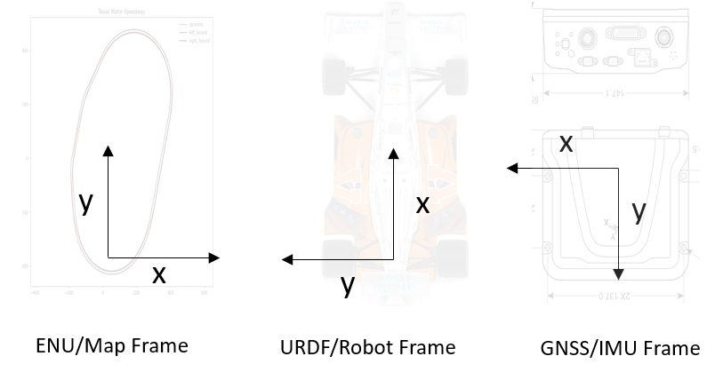
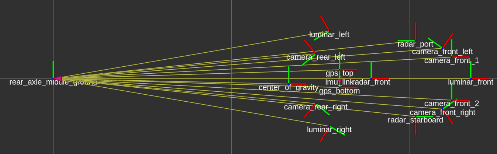
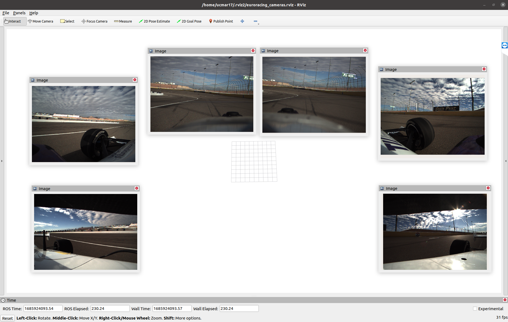

# RACECAR Dataset
Welcome to the RACECAR dataset!

[](http://www.youtube.com/watch?v=h3pEPBt8iaY "RACECAR Dataset - GPS Labels of LiDAR")
<!--  -->

The RACECAR dataset is a collection of racing scenarios with full scale and high speed autonomous Indy Lights cars. These vehicles captured a plethora of LiDAR, Camera, Radar, GNSS, and IMU data during the 2021-2022 racing season of the [Indy Autonomous Challenge](https://www.indyautonomouschallenge.com).

This repository contains scripts used to parse the dataset, custom ros messages describing GNSS/IMU/Radar data, and a conversion script that converts ros2 bags to [nuScenes](https://www.nuscenes.org/nuscenes) json files.

Please contact the corresponding author at ark8su@virginia.edu for access to the dataset.


## Data Usage and License
This work is licensed under the Creative Commons Attribution-NonCommercial 4.0 International Public License (CC BY-NC 4.0). To obtain a copy of this license, see LICENSE-CC-BY-NC-4.0.txt in the archive, visit CreativeCommons.org or send a letter to Creative Commons, PO Box 1866, Mountain View, CA 94042, USA.

Under the following terms:

Attribution — You must give appropriate credit, provide a link to the license, and indicate if changes were made. You may do so in any reasonable manner, but not in any way that suggests the licensor endorses you or your use.
NonCommercial — You may not use the material for commercial purposes.
No additional restrictions — You may not apply legal terms or technological measures that legally restrict others from doing anything the license permits.

## Data Organization

Each autonomous run from the AV21 was captured with all sensor information stored in rosbags, parsed, and appended with local coordinates in the East-North-Up (ENU) coordinate frame. 

### Dataset Folder Structure

```
RACECAR
    ├── S1
    │   ├── C_SOLO-SLOW-70
    │   │   ├── metadata.yaml
    │   │   └── SOLO-SLOW-70.db3
    │   ├── M_SOLO-SLOW-70
    │   │   ├── metadata.yaml
    │   │   └── SOLO-SLOW-70.db3
    │   └── P_SOLO-SLOW-70
    │       ├── metadata.yaml
    │       └── SOLO-SLOW-70.db3
    ...
    ├── S6
    │   ├── E_MULTI-FAST-TUM
    │   │   ├── metadata.yaml
    │   │   └── MULTI-FAST-TUM.db3
    │   ├── T_MULTI-FAST-EURO
    │   │   ├── metadata.yaml
    │   │   └── MULTI-FAST-EURO.db3
    │   └── T_MULTI-FAST-POLI
    │       ├── metadata.yaml
    │       └── MULTI-FAST-POLI.db3
```

The ROS2 portion of the dataset is organized by scenario, with each folder within the scenario folder corresponding to a rosbag. Each of the scenario folders or specific rosbags can be replayed with the typical rosbag2 commands and can be downloaded independently or together.

### Scenario Description


### ROS2 Topics

All topics in the dataset are namespaced by their vehicle number. Each rosbag contains all sensor data available from the ego vehicle, and if a multi-agent label is included, it will be present as an `nav_msgs/msg/Odometry` topic named `local_odometry`.

If additional namespacing or merging is required, a script is included in the racecar_utils folder called rosbag_merger. The inbuilt rosbag2 cli tools available in ROS2 Humble are also useful for performing bag merging and conversion.

### Custom ROS2 Messages

The `delphi_esr_msgs`, `novatel_oem7_msgs`, and `novatel_gps_msgs` are the radar and gps messages obtained from the Autonomous Stuff and Novatel drivers. Install these packages in order to parse the radar and novatel custom messages in the dataset.

|Topic Name|Topic Type|Description|
|----------|----------|-----------|
|`camera/xxx/camera_info`| `sensor_msgs/msg/CameraInfo`|Distortion parameters and Intrinsic Camera Matrix|
|`camera/xxx/image/compressed`| `sensor_msgs/msg/CompressedImage`|Compressed camera image buffer and compression format|
|`luminar_points`| `sensor_msgs/msg/PointCloud2`|Merge LiDAR point cloud from all three sensors|
|`luminar_xxx_points`| `sensor_msgs/msg/PointCloud2`|LiDAR point cloud corresponding to xxx sensor|
|`novatel_xxx/bestgnsspos`| `novatel_oem7_msgs/msg/BESTPOS`|Best available GNSS solution from Novatel PwrPak. Measurement located at antenna phase center transmitted at 20 Hz|
|`novatel_xxx/bestpos`| `novatel_oem7_msgs/msg/BESTPOS`|Best available GNSS solution from Novatel PwrPak. Measurement located at antenna phase center transmitted at 20 Hz|
|`novatel_xxx/bestvel`| `novatel_oem7_msgs/msg/BESTVEL`|Velocity derived from differentiated position. Uses the same solution method from BESTPOS transmitted at 20 Hz|
|`novatel_xxx/heading2`| `novatel_oem7_msgs/msg/HEADING2`|Heading derived from alignment of dual antenna system at variable rate|
|`novatel_xxx/oem7raw`| `novatel_oem7_msgs/msg/Oem7RawMsg`|Binary data received from Novatel receivers before driver processing|
|`novatel_xxx/rawimu`| `novatel_oem7_msgs/msg/RAWIMU`|Accelerometer and Gyroscope data transmitted from receiver at 125 Hz|
|`novatel_xxx/rawimux`| `sensor_msgs/msg/Imu`|Accelerometer and Gyroscope data transmitted from receiver at 125 Hz|
|`novatel_xxx/time`| `novatel_oem7_msgs/msg/TIME`|Satellite time accompanying GNSS packets|
|`radar_front/esr_status1`| `delphi_esr_msgs/msg/EsrStatus1`||
|`radar_front/esr_status2`| `delphi_esr_msgs/msg/EsrStatus2`||
|`radar_front/esr_status3`| `delphi_esr_msgs/msg/EsrStatus3`||
|`radar_front/esr_status4`| `delphi_esr_msgs/msg/EsrStatus4`||
|`radar_front/esr_status5`| `delphi_esr_msgs/msg/EsrStatus5`||
|`radar_front/esr_status6`| `delphi_esr_msgs/msg/EsrStatus6`||
|`radar_front/esr_status7`| `delphi_esr_msgs/msg/EsrStatus7`||
|`radar_front/esr_status8`| `delphi_esr_msgs/msg/EsrStatus8`||
|`radar_front/esr_track`| `delphi_esr_msgs/msg/EsrTrack`|Radar detection|
|`radar_front/esr_valid1`| `delphi_esr_msgs/msg/EsrValid1`||
|`radar_front/esr_valid2`| `delphi_esr_msgs/msg/EsrValid2`||
|`radar_front/esr_vehicle1`| `delphi_esr_msgs/msg/EsrVehicle1`||
|`radar_front/esr_vehicle2`| `delphi_esr_msgs/msg/EsrVehicle2`||
|`radar_front/from_can_bus`| `can_msgs/msg/Frame`|Raw CAN data received from Aptiv ESR Radar|
|`radar_front/to_can_bus`| `can_msgs/msg/Frame`|Raw CAN data sent to Aptiv ESR Radar|
|`radar_front/radar_visz_moving`| `visualization_msgs/msg/Marker`|Visualization of radar detection|
|`radar_front/radar_visz_static`| `visualization_msgs/msg/Marker`|Visualization of radar detection|
|`radar_xxx/marker`| `visualization_msgs/msg/Marker`|Visualization of radar detection|
|`radar_xxx/detection`| `delphi_mrr_msgs/msg/Detection`|Detection from Aptiv MRR Radar|
|`local_odometry`| `nav_msgs/msg/Odometry`|Vehicle odometry in Cartesian coordinates derived from RTK GNSS solution|

### Coordinate Conventions

The novatel pwrpak7 used to collect GNSS measurements on the AV21 uses a Y-forward, X-right, Z-up coordinate convention. Exact measurements and orientation can be found [here](https://docs.novatel.com/OEM7/Content/Technical_Specs_Receiver/PwrPak7_Mechanicals.htm).

Due to cabling considerations, the placement of the unit is rotated 180 degrees around the Z-axis in the vehicle. Therefore orientation measurements coming from topics such as `novatel_oem7_msgs/msg/BESTVEL`, must be rotated 180 degrees in order to correctly correspond to the YXZ convention.

The accompanying Unified Robotics Description Format (urdf) has a coordinate convention of X-forward, Y-left, Z-up. In order to properly match with this convention, orientation and velocity measurements (from the IMU for example) should be rotated a subsequent 90 degrees counter-clockwise. A 90 degree clockwise rotation will equate to the same series of transformations.



We have taken into account these rotations in the `local_odometry` topic, but if you desire to use the raw measurements to do your own sensor fusion or filtering, please take these orientations into account.

The accompanying urdf contains joints for every sensor on the car, as well as the approximate center of gravity. These were measured during the initial assembly of the car.



## Using the Dataset

### Installation of Custom ROS2 Messages

- novatel_oem7_msgs
- novatel_gps_msgs
- delphi_esr_msgs
- can_msgs

First create a dev workspace that looks like the following. This will be our working directory.

```
├── data
│   └── RACECAR
└── racecar_ws
    ├── conversion_configs
    ├── urdf
    ├── racecar_py
    ├── racecar_utils
    ├── ros2_custom_msgs
    └── rosbag2nuscenes
```

In the working directory source your ROS2 installation, and build the packages in `racecar_utils` and `ros2_custom_msgs`. Source the installation folder in the working directory to then use the installed messages.
```
source /opt/ros/${ROS_DISTRO}/setup.bash
colcon build
source install/setup.bash
```

The `can_msgs` package should be available via apt.

```
sudo apt install ros-${ROS_DISTRO}-can-msgs
```

### Visualization in RVIZ

When replaying a bag, it is recommended to publish the ego vehicles odometry as part of the tf tree, in order to visualize it's position and sensor data in reference to the inertial map frame.

We have provided an example node `odom_to_tf.cpp`, that takes in the `local_odometry` topics from both the ego and opponenet vehicles and publishes them to the tf tree. It is important to have the ego vehicle's frame match up with the appropriate frame in the URDF so that LiDAR and Radar point clouds can be easily visualized.

The node and accompanying launch file should be built along with `racecar_utils`. To run, use the launch file and use the provided parameters to remap the odometry topic names appropriately. Click the following image to see an example of the RVIZ visualization.

```
ros2 launch racecar_utils odom_to_tf.launch.py ego_topic:=/vehicle_3/local_odometry opp_topic:=/vehicle_5/local_odometry
```

[](http://www.youtube.com/watch?v=5KDiXADwiO8 "RACECAR Dataset - GPS Labels of LiDAR")

**Camera RVIZ**

We have also provided an RVIZ config for visualizing camera images from the bags.

```
./racecar_utils/rviz/cameras.rviz
```



Please note that this RVIZ configuration is set to show the images from all six bag topics in the format `camera_idX_imageU8`, which is different from the specified camera topics above. If you would like to visualize other camera topics, you may simply change the topic information in the RVIZ configuration.


### nuScenes Data Format

We have also released the dataset in the [nuScenes format](https://www.nuscenes.org/nuscenes) for easier accessibility to those unfamiliar with ROS2.

Our nuScenes schema deviates slightly from the original. First, we have classified each ROS2 bag as a scene rather than splitting each bag into twenty second intervals. We believe the longer scene intervals (typically over 10 mins) widens opportunities for exploration into mapping and localization problems. Second, our dataset has no entries in the Annotation or Taxonomy JSON files due to the absence of annotations. These files are still present but have dummy entires to maintain compatibilty with the [Python nuScenes development kit](https://pypi.org/project/nuscenes-devkit/). [This guide](TODO) provides a walkthrough of how to explore the nuScenes release using the Python development kit. Similar to the nuScenes release, we have batched the sensor data from each scene into separate tarballs to allow users to only download the data they are interested in working with. Each tarball follows the naming convention of `{TEAM_NAME}_{BAG NAME}.tar.gz` for clarity purposes.
